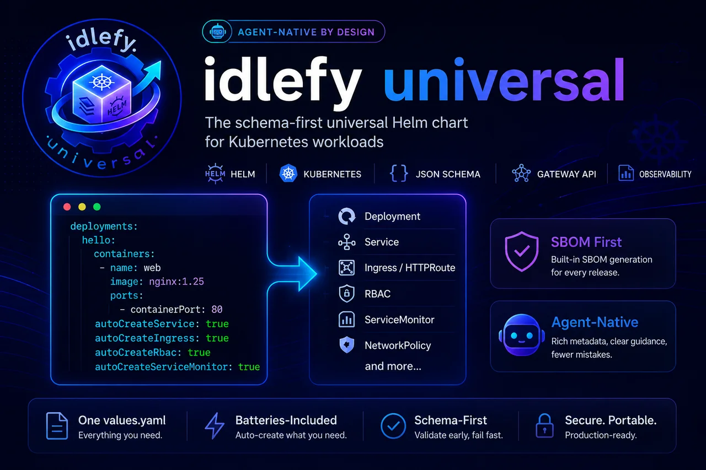

---
hide:
  - navigation
  - toc
---

{ .idlefy-hero }

# idlefy-universal

> Schema-driven, agent-native Helm chart for any Kubernetes workload.

[Get started](#deploy-with-an-ai-agent){ .md-button .md-button--primary }
[Reference](reference/values.md){ .md-button }
[GitHub](https://github.com/idlefy/idlefy-universal){ .md-button }

## Deploy with an AI agent

`idlefy-universal` ships [`agent-index.json`](reference/agent-metadata.md#agent-indexjson)
— a flat, machine-readable description of every value with `whenToUse`,
`relatedFields`, `commonMistakes`, and `exampleUseCase`. Every release is
signed (cosign keyless), SBOM-attached, and carries SLSA L3 provenance,
so an agent can self-verify the artifact before installing it.

The fastest way to deploy: hand your favourite AI agent the
[`idlefy-deploy` wizard](how-to/wizard.md). One sentence in your agent's
chat:

> Using <https://raw.githubusercontent.com/idlefy/idlefy-universal/main/skills/idlefy-deploy/SKILL.md>, help me deploy this project to Kubernetes via idlefy-universal.

The wizard scans your repo, drafts a `values.yaml`, asks only the
questions the scan couldn't answer, and validates with `helm template`.
See [Use the deploy wizard](how-to/wizard.md) for details and failure-mode notes.

Further reading:

- [How-To → Verify the chart's supply chain](how-to/verify-supply-chain.md) — three-command gate
- [Concepts → Agent-native](concepts/agent-native.md) — why the metadata lives inside the schema
- [Reference → Agent metadata](reference/agent-metadata.md) — the `x-agent-*` keyword spec and `agent-index.json` shape

## Why idlefy-universal

- **Typed values contract.** A strict JSON Schema (2020-12) rejects typos and cross-field mistakes before the chart reaches the cluster. `helm install` and `helm template` both validate. Errors include the JSON Pointer path to the failing field.
- **Agent-native metadata.** First-class `x-agent-*` keywords on every schema node plus a machine-readable `agent-index.json` — designed for skills, docs generators, and MCP-style tooling. No separate "agent SDK" required.
- **Batteries-included auto-creation.** One flag each for Service, Ingress, Certificate, ServiceMonitor, PodDisruptionBudget, NetworkPolicy, RBAC (Role + RoleBinding), and ServiceAccount. Defaults wire through `*General` for chart-wide composition.
- **Modern Kubernetes.** Gateway API HTTPRoute alongside classic Ingress. StatefulSet and DaemonSet are first-class workload kinds. Requires Kubernetes 1.31+; CI-tested on 1.35.

## Deploy by hand

If you'd rather drive the install yourself, a four-line `values.yaml`:

```yaml
deployments:
  hello:
    replicas: 1
    containers:
      main: {image: nginx, imageTag: "1.27-alpine"}
```

Install:

--8<-- "_snippets/install.md"

For a guided walkthrough, see [your first app](tutorials/your-first-app.md).

## Stack

[](https://helm.sh)
[](https://kubernetes.io)
[](https://json-schema.org)
[](https://github.com/idlefy/idlefy-universal/blob/main/LICENSE)

---

_schema-driven · agent-native_
